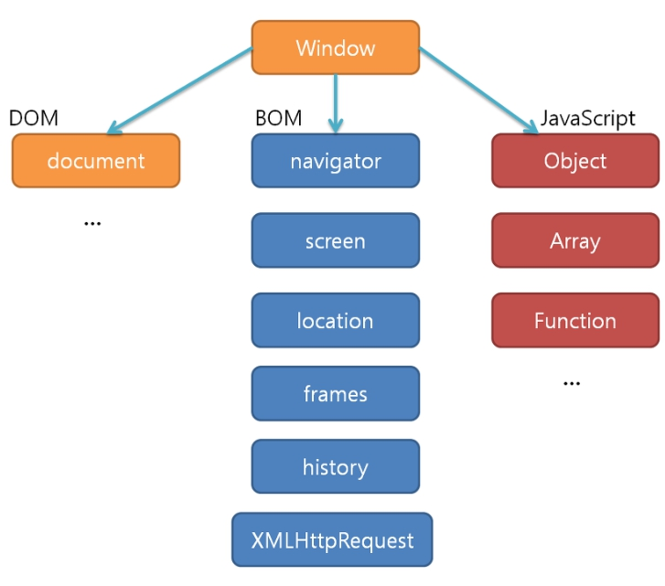
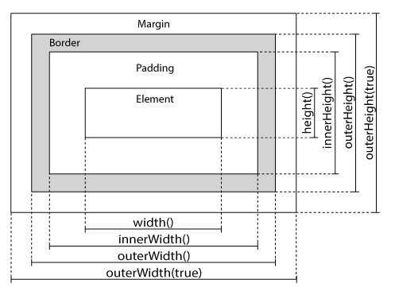

# NOTE

1. 내장객체
    - BOM (Browser Object Model, 브라우저 객체 모델)
    - DOM (Document Object Model, 문서 객체 모델)
    - Global JavaScript Object (전역 자바스크립트 객체)
2. ready, load, IIFE(Immediately Invoked Function Expressions)
3. width / height
4. offset() / position()
5. eq()
6. 삼항연산자
7. 반복문 each, for
8. 배열
9. Event (scroll, click)

## 1. BOM(Browser object Model)
* 브라우저 객체 모델
* 브라우저는 브라우저 창과 이 창이 현재 보여주고 있는 페이지 등을 표현하기 위한 내장 객체들을 가짐
  * BOM
  * DOM
  * Global JavaScript Object



<br>

### BOM (Browser Object Model, 브라우저 객체 모델)
* 최상위 객체는 window 객체
* 현재 브라우저 창이나 탭을 표현하는 객체
* 이 객체의 자식 객체들은 브라우전의 다른 기능들을 표현

> #### Window
> 현재 브라우저 창이나 탭
> * Document<br>
>   현재 로드된 웹 페이지
> * History<br>
>   브라우저 히스토리에 기록된 웹 페이지들
> * Location<br>
>   현재 페이지의 URL
> * navigator<br>
>   브라우저와 관련된 정보
> * Screen<br>
>   장치의 디스플레이 정보<br>
> <br>
> window.pageYoffeset: 문서의 세로 스크롤 크기 (단위: px)

### DOM (Document Object Model, 문서 객체 모델)
* 최상위 객체는 document 객체
* 현재 웹 페이지의 모델 생성 및 전체 페이지를 표현
* 자식 객체로는 페이지의 다른 요소들을 표현하는 객체들이 사용

### Global JavaScript Object (전역 자바스크립트 객체)
* 어떤 특정 모델을 표현하지는 않음
* 자바스크립트 언어의 각기 다른 부분을 담당하는 관련 객체들의 집합
* 전역 객체의 이름은 주로 대문자로 시작
  
> #### 기본적인 데이터 타입 표현
> * String<br>
>   문자열
> * Number<br>
>   숫자
> * Boolean<br>
>   참/거짓
> #### 실제 세계의 개념들을 다루기 위한 것
> * Date<br>
>   날짜 표현 및 조작
> * Math<br>
>   숫자 값 및 숫자를 이용한 다양한 연산 수행
> * RegEx<br>
>   텍스트를 구성하는 문자열 내의 패턴 처리

<br>

## 2. load, ready, IIFE(Immediately Invoked Function Expressions)
* load<br>
  * .load() > .on() 메서드로 대체됨
  * 페이지와 나머지 모든 리소스(image, css, script)가 로드된 이후에 발생
  * 스크립트가 반드시 로드되어야하는 리소스에 의존적일 때 사용
    ex) 이미지 사이즈를 알아야 하는 경우
  * 모든 브라우저에서 동작
  * 메서드 내에 선언된 변수에 대한 함수 수준의 범위를 제공
  ```
  $(window).on('load', function(){
      console.log('load');
  });
  ```
* ready<br>
  * DOM이 로드되자 마자 실행 (== 리소스가 로딩될때까지 기다리지 않음)
  * 최신 브라우저들에서만 지원 (== 구버전의 브라우저에서는 load 이벤트가 발생할 때까지 기다림)
  ```
  $(document).ready(function(){
      console.log('ready');
  });
  ```
* IIFE<br>
  * 즉시 실행 함수
  * ready 대신 주로 사용
  ```
  (function($){}(jQuery));
  (function($){})(jQuery);
  ```

<br>

## 3. width / height
* width() / innerWidth() / outerWidth() / outerWidth(true)
  * width()<br>
    영역의 너비 리턴(바깥 여백, 테두리, 안쪽 여백 미포함)
  * innerWidth()<br>
    안쪽여백을 포함한 너비 리턴(바깥 여백, 테두리 미포함)
  * outerWidth()<br>
    안쪽여백, 테두리를 포함한 너비 리턴(바깥 여백 미포함)
  * outerWidth(ture)<br>
    안쪽여백, 테두리, 바깥 여백을 포함한 너비 리턴
* height() / innerHeight() / outerHeight() / outerHeight(ture)
  * height()<br>
    영역의 높이 리턴(바깥 여백, 테두리, 안쪽 여백 미포함)
  * innerHeight()<br>
    안쪽여백을 포함한 높이 리턴(바깥 여백, 테두리 미포함)
  * outerHeight()<br>
    안쪽여백, 테두리를 포함한 높이 리턴(바깥 여백 미포함)
  * outerHeight(ture)<br>
    안쪽여백, 테두리, 바깥 여백을 포함한 높이 리턴



<br>

## 4. offset() / position()
* offset()<br>
  document 객체의 좌측 상단 모서리에서부터 요소까지의 좌표
* position()<br>
  상위 요소 중 기본 흐름 값을 가진 요소로부터 해당 요소까지의 좌표<br>
  기본 흐름 값을 가진 상위 요소가 존재하지 않으면 offset() 메서드와 동일한 값 리턴
* top / left<br>
  top: 문서나 상위 요소의 상단으로부터의 위치<br>
  left: 문서나 상위 요소의 좌측으로부터의 위치

<br>

## 5. eq()
  * 필터링 메소드 중 하나
  * 인덱스 번호에 해당하는 요소를 리턴
  * 첫번째 요소의 인덱스 == 0
  * 인덱스가 음수 == 선택한 요소 집합의 맨 마지막(== -1) 부터 반대로 검색

<br>

## 6. 삼항연산자
* 조건문 ? 참일 경우 리턴 값 : 거짓일 경우 리턴 값
  ```
  !$(window).scrollTop() == 0 ? header.addClass('scroll') : header.removeClass('scroll');
  ```

<br>

## 7. 반복문 each, for
* each()<br>
  * 객체 집합에서 각 요소의 값을 가져오고자 할 때 or 각 요소에 연속된 동작을 수행하고자 할 때 사용
  * 일반 메서드
    ```
    /*
      - index: index
      - item: selector
    */
    $('.content').each(function(index, item) {
        console.log('index: ', index, ', item: ', item)
    });
    ```
  * 유틸리티 메서드
    ```
    var arr = [
        {title: 'daum', url: 'http://daum.net'},
        {title: 'naver', url: 'http://naver.com'}
      ],
        obj = {
          daum: 'http://daum.net',
          naver: 'http://naver.com'
      };

    /* 2-1. 유틸리티 메서드 (객체)
      - index: 객체의 키(property)
      - item: 키의 값
    */
    $.each(obj, function(index, item) {
        console.log(index + ' : ' + item);
    });

    /* 2-2. 유틸리티 메서드 (배열)
      - index: 배열의 index or 객체의 키
      - item: index or 키가 가진 값
    */
    $.each(arr, function(index, item) {
        console.log(index + ' : ' + item.title + ', ' + item.url);
    });
    ```
* for<br>
  ```
  for(초기값;조건식;증감식) {반복 실행 코드}
  ```

<br>

## 8. 배열
* 배열 선언 방법 3가지
  ```
  var arr = new Array();
  var arr2 = new Array("0","1","2");
  var arr3 = [];
  ```

<br>

## 9. Event (scroll, click)
* scroll
* click


<br>

***

<br>

## [참고하면 좋은 자료]
* [웹 브라우저의 HTML문서 렌더링 과정 1](https://hahahoho5915.tistory.com/28)
* [웹 브라우저의 HTML문서 렌더링 과정 2](https://nesoy.github.io/articles/2017-05/Jquery-onready)
* [ready, load, IIFE](http://tcpschool.com/jquery/jq_basic_syntax)
* [IIFE](https://velog.io/@jakeseo_me/%EC%9E%90%EB%B0%94%EC%8A%A4%ED%81%AC%EB%A6%BD%ED%8A%B8-%EA%B0%9C%EB%B0%9C%EC%9E%90%EB%9D%BC%EB%A9%B4-%EC%95%8C%EC%95%84%EC%95%BC-%ED%95%A0-33%EA%B0%80%EC%A7%80-%EA%B0%9C%EB%85%90-8-%EC%9E%90%EB%B0%94%EC%8A%A4%ED%81%AC%EB%A6%BD%ED%8A%B8-%ED%95%84%EC%88%98%EC%9A%94%EC%86%8C-IIFE-%EB%A7%88%EC%8A%A4%ED%84%B0%ED%95%98%EA%B8%B0)
* [요소의 크기](http://tcpschool.com/jquery/jq_elementDimension_size)
* [요소의 위치](http://tcpschool.com/jquery/jq_elementDimension_position)
* [반복문 each()](https://webclub.tistory.com/455)
* [이벤트](http://tcpschool.com/jquery/jq_event_handling)
* [메소드 정리](https://turfrain.tistory.com/entry/1-jQuery-%EB%A9%94%EC%86%8C%EB%93%9C-%EC%A0%95%EB%A6%AC)